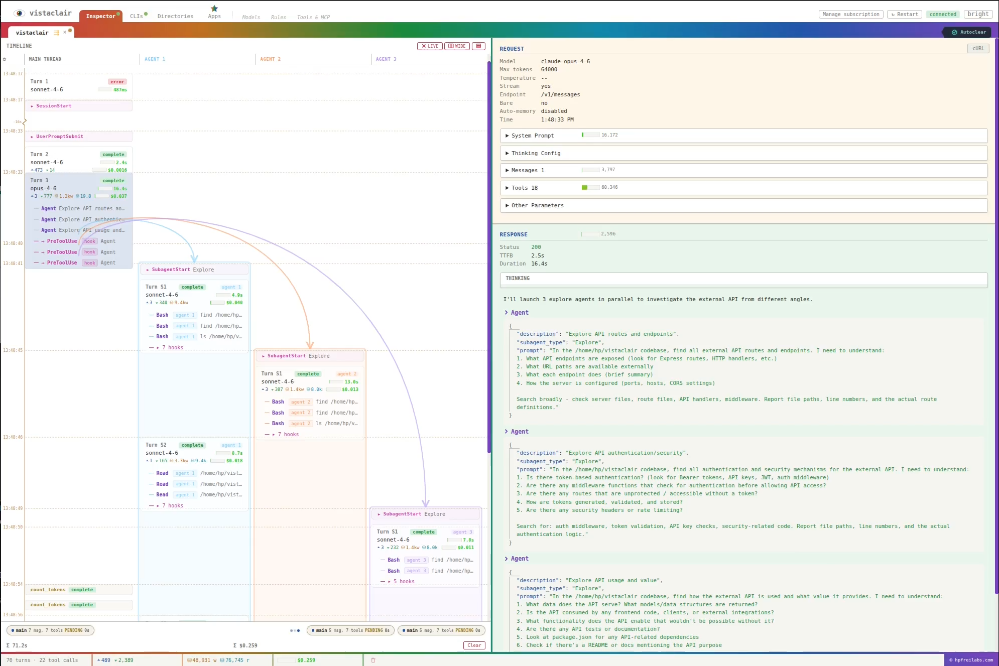
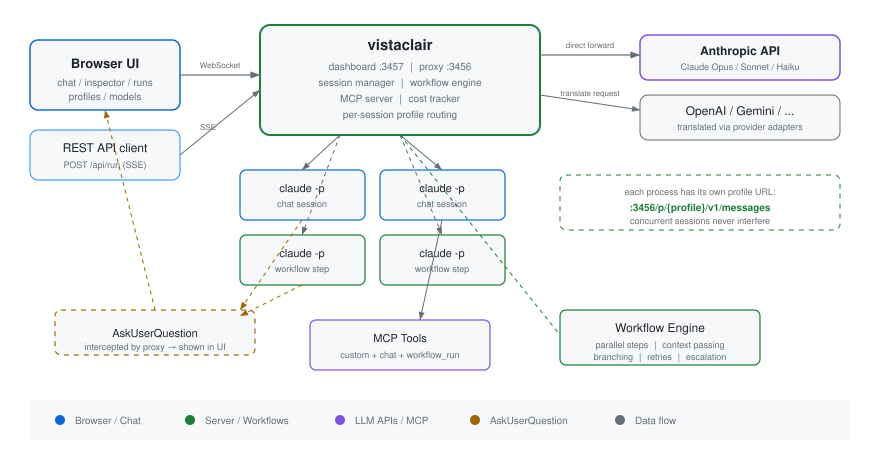
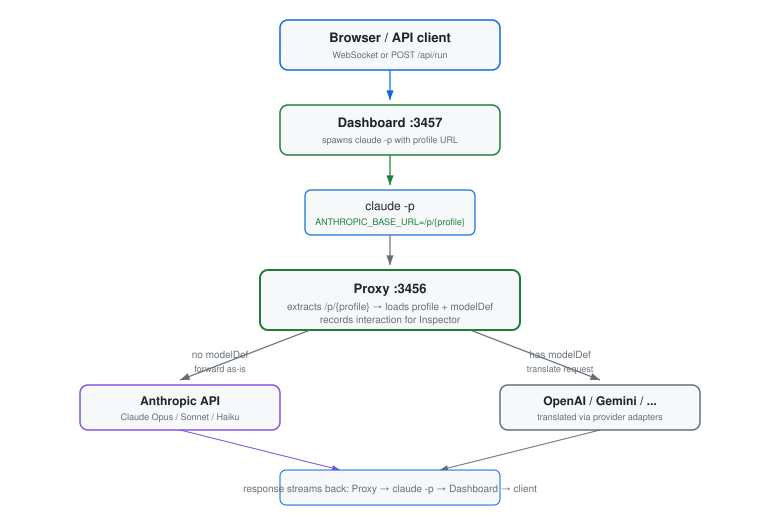

<div align="center">


# vistaclair

**Agent inspector, control room, and transparent proxy for Claude Code.**

[](https://www.npmjs.com/package/vistaclair)
[](https://www.npmjs.com/package/vistaclair)
[](https://opensource.org/licenses/Apache-2.0)
[](https://nodejs.org)

</div>

```bash
npx vistaclair
```

I built this because I wanted to see what Claude Code actually sends to the LLM — the full requests, tool calls, hooks, subagent threads, token counts. The Inspector shows all of it on the wire, in real time, across sessions. From there it grew into a full control surface: multi-tab CLI sessions I can steer from a phone over a tunnel, proxy rules that rewrite or reroute requests to OpenAI/Gemini/DeepSeek/Ollama before they hit the API, and an integrated MCP server for custom tools. I use it daily.

<div align="center">

https://github.com/user-attachments/assets/3d82bb12-87e1-4e20-aa98-52d4f3512062



</div>

---

## Getting started

**Requires:** Node.js 18+ and [Claude Code CLI](https://docs.anthropic.com/en/docs/claude-code) (authenticated).

```bash
npm install -g vistaclair
vistaclair
```

Or clone:

```bash
git clone https://github.com/hpfrei/vistaclair.git
cd vistaclair && npm install && npm start
```

Open **http://localhost:3457** and log in with the auth token printed to the console.

> [!TIP]
> **Use Claude through the proxy** — run this in any terminal to route all traffic through vistaclair:
> ```bash
> ANTHROPIC_BASE_URL=http://localhost:3456 claude
> ```
> Works with interactive sessions, `claude -p "prompt"`, and IDE integrations. Traffic appears in the Inspector.

> [!TIP]
> Custom port: `npm start -- 8080` or `DASHBOARD_PORT=8080 npm start`

### Environment variables

| Variable | Default | Description |
|---|---|---|
| `AUTH_TOKEN` | auto-generated | Dashboard auth token |
| `PROXY_PORT` | `3456` | API proxy port (localhost only) |
| `DASHBOARD_PORT` | `3457` | Web dashboard port (all interfaces) |
| `ANTHROPIC_TARGET_URL` | `https://api.anthropic.com` | Upstream API URL |
| `MAX_HISTORY` | `200` | Max interactions kept in memory |

> [!WARNING]
> The dashboard binds to `0.0.0.0` for remote access. It is protected by the auth token, but do not expose it to untrusted networks without TLS/VPN.

---

## What it does

**Inspector** — Full request/response capture across all sessions. System prompts, message history, tool definitions, tool call inputs/outputs (JSON tree), thinking blocks, SSE event stream, cURL export. Token breakdown (input, output, cache read/create, reasoning) and cost tracking per turn, per group, per session. Subagent tracking with color-coded parallel swimlane view. Hook events nested under the turns that triggered them. All interactions saved to disk as JSON.

**CLI** — Multi-tab Claude Code terminal in the browser. Per-session model routing, directory spawning, session save/resume. **Paste screenshots from clipboard or drag-drop files directly into a session** — works over a tunnel from any device. AskUserQuestion appears inline — answer from any browser and Claude continues.

**Provider routing** — Route through Anthropic, OpenAI, Gemini, DeepSeek, Kimi, or Ollama. 40+ models pre-configured. The proxy translates Anthropic Messages API to the target format transparently.

**Proxy rules** — JavaScript middleware that intercepts every request. Swap models, strip tools, inject prompts, short-circuit responses. Describe in English, vistaclair generates the JS. Hot-reloaded, toggleable.

**MCP tools** — Define custom tools in the browser with typed parameters and a JS handler. Claude gets the capability instantly. Built-in: `vista-AskUserQuestion` (routes questions to dashboard UI), `chat` (sub-session delegation).

**File manager** — Browse, preview, and manage files on the remote machine. Monaco editor, multi-select, integrated shell.

**Skills, agents, hooks** — Create and edit `.claude/` skills, agents, and hooks from the dashboard.

**[External API](VISTACLAIR_CONNECT.md)** — REST and WebSocket interface for programmatic access.

---

## Architecture

<picture>
  <source media="(prefers-color-scheme: dark)" srcset="docs/architecture-dark.svg">
  <source media="(prefers-color-scheme: light)" srcset="docs/architecture-light.svg">
  
</picture>

Two servers, one process:

| Server | Port | Binding | Purpose |
|---|---|---|---|
| **Proxy** | `:3456` | `127.0.0.1` | Intercepts Claude API calls for inspection and routing |
| **Dashboard** | `:3457` | `0.0.0.0` | Web UI, REST API, WebSocket (auth-protected) |

Every `claude` process gets a unique instance ID in its base URL (`http://localhost:3456/i/{id}`), so concurrent sessions are fully isolated.

<picture>
  <source media="(prefers-color-scheme: dark)" srcset="docs/request-flow-dark.svg">
  <source media="(prefers-color-scheme: light)" srcset="docs/request-flow-light.svg">
  
</picture>

---

## License

**Apache 2.0** — see [LICENSE](LICENSE). Copyright 2026 [hpfreilabs.com](https://hpfreilabs.com)

Everything above is free and open source. **vistaclair Pro** adds the Apps Platform as a separately licensed commercial add-on. [Learn more →](https://hpfreilabs.com)
